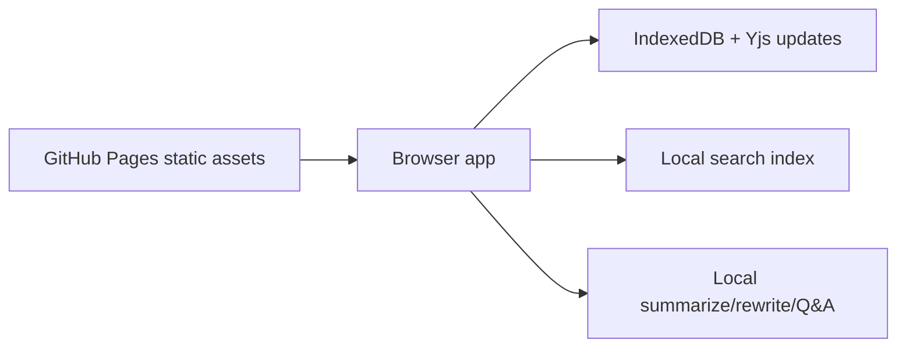

# local-notion-ai


https://baditaflorin.github.io/local-notion-ai/

Offline-first Notion AI alternative for summarizing, rewriting, and querying your local workspace.

The app runs locally in the browser, keeps user documents in browser storage, and exposes no runtime backend.


## Quickstart

```sh
make install-hooks
make dev
make test
make build
make pages-preview
```

## Links

Live site:

https://baditaflorin.github.io/local-notion-ai/

Repository:

https://github.com/baditaflorin/local-notion-ai

Support:

https://www.paypal.com/paypalme/florinbadita

## Architecture



Architecture docs:

https://github.com/baditaflorin/local-notion-ai/blob/main/docs/architecture.md

ADRs:

https://github.com/baditaflorin/local-notion-ai/tree/main/docs/adr

Deploy guide:

https://github.com/baditaflorin/local-notion-ai/blob/main/docs/deploy.md
