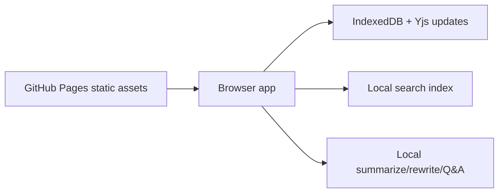

# local-notion-ai


https://baditaflorin.github.io/local-notion-ai/

Offline-first Notion AI alternative for summarizing, rewriting, and querying your local workspace.

The app runs locally in the browser, keeps user documents in browser storage, and exposes no runtime backend. The live page shows the exact app version and commit in the header.


## Quickstart

```sh
make install-hooks
make dev
make test
make build
make pages-preview
```

## Verified Features

- Local document import from file upload, multi-file upload, drag/drop, paste, clipboard text, CORS-accessible URLs, JSON restore, share links, and autosaved browser state.
- Local summarization, rewriting, and Q&A over imported documents with document-shape inference, confidence, warnings, and citations.
- Outputs through JSON state export, deterministic CSV analysis export, copy-to-clipboard, small hash share links, and print-friendly AI reports.
- Browser persistence through IndexedDB/Yjs plus a small versioned settings store for debug default, auto-summary after import, and normalized preview.
- Public static deployment on GitHub Pages with no runtime backend and no secrets in the frontend.

## Tested Paths

- Unit and fixture tests cover 10 real-world inputs in `tests/fixtures/realdata/`.
- Playwright smoke test covers GitHub link visibility, sample workflow, Q&A, file import, paste import, and CSV export.
- `make smoke` builds the Pages site into `docs/`, serves it under `/local-notion-ai/`, and runs the browser test.

## Limitations

- Image/OCR import is not supported.
- Folder import is not supported; select multiple files instead.
- URL import only works for pages that allow browser CORS reads. For blocked pages, copy the rendered page text or HTML and paste it into the app.
- There is no account, server sync, collaboration, API, embed code, or backend proxy in Mode A.
- Large workspaces may exceed browser URL limits for share links; use JSON export for those.

## Links

Live site:

https://baditaflorin.github.io/local-notion-ai/

Repository:

https://github.com/baditaflorin/local-notion-ai

Support:

https://www.paypal.com/paypalme/florinbadita

## Architecture



Architecture docs:

https://github.com/baditaflorin/local-notion-ai/blob/main/docs/architecture.md

ADRs:

https://github.com/baditaflorin/local-notion-ai/tree/main/docs/adr

Deploy guide:

https://github.com/baditaflorin/local-notion-ai/blob/main/docs/deploy.md
