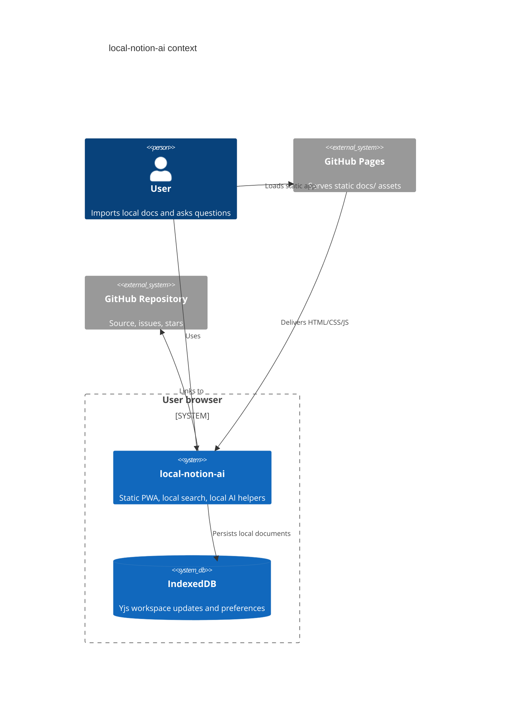
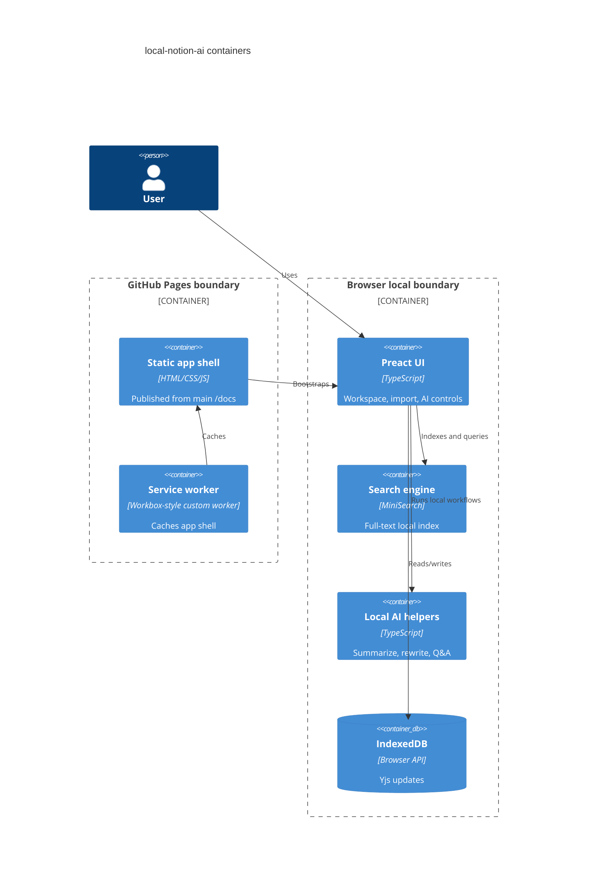

# Architecture

`local-notion-ai` is a Mode A GitHub Pages app. There is no runtime backend.

## Context

```mermaid
C4Context
  title local-notion-ai context
  Person(user, "User", "Imports local docs and asks questions")
  System_Boundary(browser, "User browser") {
    System(app, "local-notion-ai", "Static PWA, local search, local AI helpers")
    SystemDb(indexeddb, "IndexedDB", "Yjs workspace updates and preferences")
  }
  System_Ext(pages, "GitHub Pages", "Serves static docs/ assets")
  System_Ext(repo, "GitHub Repository", "Source, issues, stars")
  Rel(user, app, "Uses")
  Rel(app, indexeddb, "Persists local documents")
  Rel(user, pages, "Loads static app")
  Rel(pages, app, "Delivers HTML/CSS/JS")
  Rel(app, repo, "Links to")
```

## Containers

```mermaid
C4Container
  title local-notion-ai containers
  Person(user, "User")
  Container_Boundary(pages, "GitHub Pages boundary") {
    Container(shell, "Static app shell", "HTML/CSS/JS", "Published from main /docs")
    Container(sw, "Service worker", "Workbox-style custom worker", "Caches app shell")
  }
  Container_Boundary(browser, "Browser local boundary") {
    Container(ui, "Preact UI", "TypeScript", "Workspace, import, AI controls")
    Container(search, "Search engine", "MiniSearch", "Full-text local index")
    Container(ai, "Local AI helpers", "TypeScript", "Summarize, rewrite, Q&A")
    ContainerDb(db, "IndexedDB", "Browser API", "Yjs updates")
  }
  Rel(user, ui, "Uses")
  Rel(shell, ui, "Bootstraps")
  Rel(ui, search, "Indexes and queries")
  Rel(ui, ai, "Runs local workflows")
  Rel(ui, db, "Reads/writes")
  Rel(sw, shell, "Caches")
```

See the ADRs in `docs/adr/` for decision history.
